# 웹 프레임워크를 활용한 평점 기반 커뮤니티 서비스


## 1. 목표

- 영화 정보 기반 추천 서비스 구성
- 커뮤니티 서비스 구성
- HTML, CSS, JavaScript, Django, DB 등을 활용한 실제 서비스 설계
- 서비스 배포 및 관리


## 2. 개발 환경


- Python Web Framework
  - Django 2.1.15
  - Python 3.7 + 
- 개발 아키텍처
  - Django & Vanila JS
- 서비스 배포 환경
  - Amazon Lightsail


## 3. 프로젝트 구조

- 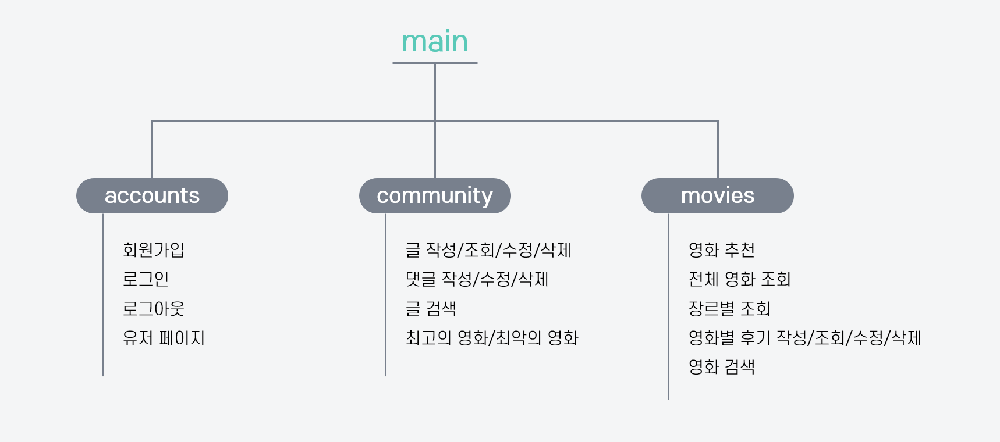

- ```bash
  └─web_pjt
      │  db.sqlite3
      │  manage.py
      │  
      ├─accounts
      │  │  admin.py
      │  │  apps.py
      │  │  models.py
      │  │  tests.py
      │  │  urls.py
      │  │  views.py
      │  │  __init__.py
      │  │  
      │  ├─migrations
      │  │          
      │  └─templates
      │     └─accounts
      │             login.html
      │             signup.html
      │             user.html
      │          
      ├─articles
      │  │  admin.py
      │  │  apps.py
      │  │  forms.py
      │  │  models.py
      │  │  tests.py
      │  │  urls.py
      │  │  views.py
      │  │  __init__.py
      │  │  
      │  ├─migrations
      │  │          
      │  └─templates
      │     └─articles
      │             detail.html
      │             form.html
      │             index.html
      │          
      ├─main
      │  │  admin.py
      │  │  apps.py
      │  │  models.py
      │  │  tests.py
      │  │  urls.py
      │  │  views.py
      │  │  __init__.py
      │  │  
      │  ├─migrations
      │  │          
      │  └─templates
      │     └─main
      │             main.html
      │          
      ├─movies
      │  │  admin.py
      │  │  apps.py
      │  │  models.py
      │  │  tests.py
      │  │  urls.py
      │  │  views.py
      │  │  __init__.py
      │  │  
      │  ├─migrations 
      │  │          
      │  └─templates
      │     └─movies
      │             index.html
      │                   
      ├─templates
      │      base.html
      │      
      └─web_pjt
          │  settings.py
          │  urls.py
          │  wsgi.py
          └─ __init__.py
  ```

  

## 4. 팀원 정보 및 업무 분담 내역

- 팀장: 이동규, 팀원: 박도희
- (도희) 사실 대부분의 시간을 VS Code Live Share와 Google Meets를 통해 함께 보냈기 때문에 누가 어떤 일을 했는가를 칼같이 나누는 것은 조금 힘들다. 특히 기본 기능에 있어서는 번갈아 가며 코드를 작성하고, 코드가 생각했던 것과 다르게 동작하거나 동작하지 않을 때에는 함께 찾아보며 수정했기에 더더욱 그렇다. 기본 기능 구현이 끝난 뒤로는 업무를 나눠서 진행하기보다는 각자 있었으면 좋겠다 싶은 기능을 조금씩 추가하는 방향으로 진행했는데 부트스트랩 활용 및 CSS와 최신 글 버튼은 동규님이 훨씬 열심히 하셨고, 검색과 영화 장르별 조회 기능은 내가 조금 더 열심히 했다. 영화별 후기 작성/조회/수정/삭제는 내가 생각해 낸 아이디어지만, 기본 기능과 별반 다르지 않은 확장 기능이므로 이 역시 함께 했다고 보는 편이 맞을 것이다.


## 5. 목표 서비스 구현 및 실제 구현 정도

- 우리가 목표로 했던 서비스는 '유저로서 내가 영화 커뮤니티에 바라는 서비스를 제공하는 사이트'였다. 기본 기능의 구현을 마친 뒤, 우리는 각자가 바라는 추가 기능을 몇 가지 구현하였다.

  - accounts
     - 유저 페이지: 자신이 작성한 글과 댓글을 모아서 볼 수 있다. 특히 자신이 작성한 글을 게시판 형식이 아니라 영화 포스터 형식에 내가 준 평점이 오버랩되는 방식으로 구현해, 포스터를 모으는 것처럼 글을 쓰는 소소한 재미를 얻을 수 있도록 구현했다.

  - community
     - 글 검색: 글의 제목으로 검색하는 어쩌면 아주 단순하지만 없어서는 안 될 기능을 구현하였다.
     - 최고의 영화/최악의 영화: 평균적인 평점도 중요하지만, 누군가에게 있어 최고의 영화, 최악의 영화가 궁금할 때가 있다. 클릭만으로 평점 10점의 리뷰와 0점의 리뷰를 볼 수 있도록 했다.
     - 최신 글: 현재 시간을 기준으로 6시간 전에 작성한 글에는 new 버튼이 생기는 기능을 통해 최근에 이 사이트에서 활동한 사람들의 흔적을 쉽게 알아볼 수 있게 만들었다.

  - movies
     - 영화 검색: 내가 원하는 영화의 제목으로 검색하는 기능을 구현하였다.
     - 장르별 조회: 내가 원하는 장르의 영화를 선택해, 그 장르의 영화를 모아보는 기능을 구현하였다.
     - 영화별 후기 작성/조회/수정/삭제: 내가 사이트의 사용자라면 전체 영화의 후기보다는 내가 원하는 영화의 후기를 모아볼 일이 더 많을 것이라고 생각했다. 영화별로 모인 글이 하나의 게시판처럼 보일 수 있게, 영화별 후기 조회/작성/수정/삭제의 기능을 추가하였다.


## 6. 데이터베이스 모델링(ERD)

- https://www.erdcloud.com/d/vMs6qaD6jq4Kevd59
- 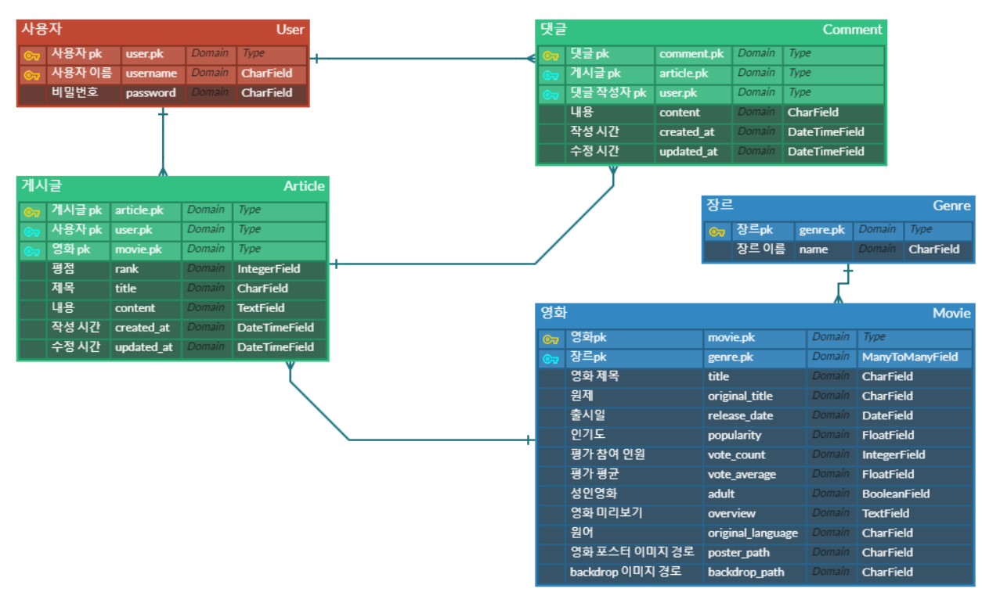


## 7. 필수 기능

- 관리자 뷰
  - 관리자 권한의 유저만 영화 등록/수정/삭제 권한을 가집니다.
  
  - 관리자 권한의 유저만 유저 관리 권한을 가집니다.
  
  - **[관리자 권한이 아닌 유저]**
  
    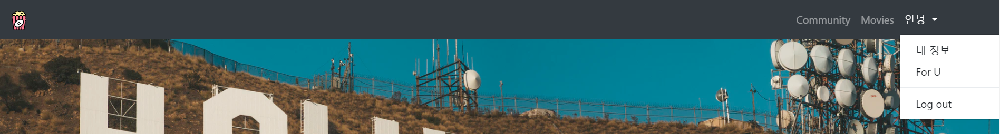
  
    - Nav-Bar의 username을 클릭했을 때, 내 정보와 For U(영화 추천 기능), Logout 버튼만이 활성화되어 있다.
  
    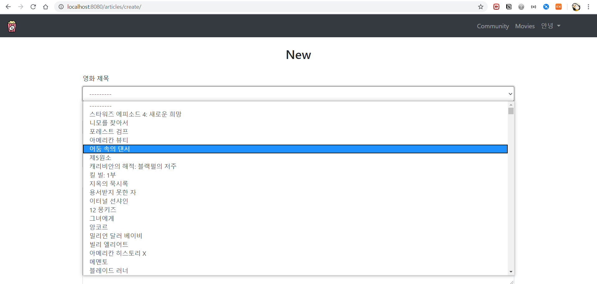
  
    - 영화 후기를 작성하고자 할 때, 이미 등록된 영화 중 하나를 선택해야만 한다. (직접 영화를 등록/수정/삭제할 수 없다.)
  
  - **[관리자 권한의 유저]**
  
    - 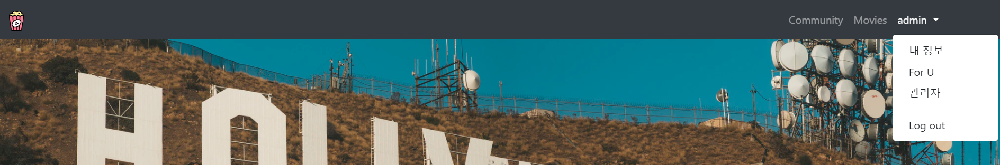
  
      - Nav-Bar의 username을 클릭했을 때, 내 정보와 For U(영화 추천 기능), **관리자 버튼**과 Logout 버튼이 활성화되어 있다.
  
    - 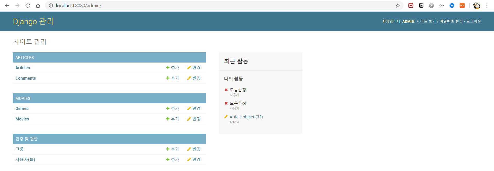
  
      - 관리자 버튼을 클릭하면, Movies뿐 아니라 Articles, Comments, Genres, Users를 관리할 수 있다.
  
      
  
- 영화 정보

  - 영화 정보는 Database Seeding을 활용해 최소 50개 이상의 데이터가 존재하도록 구성해야 합니다.

  - 모든 로그인된 유저는 영화에 대한 평점 등록/수정/삭제 등을 할 수 있어야 합니다. 

    - 현재 TMDb를 활용해 500편의 영화 데이터를 제공하고 있다.

    - 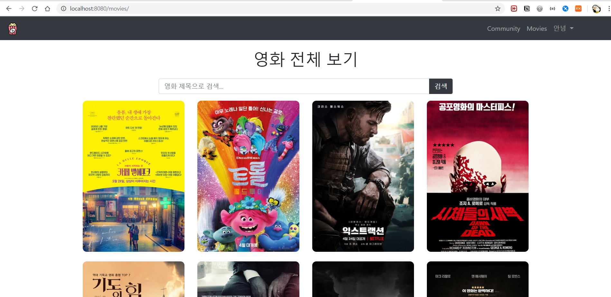

    - 영화 포스터위에 마우스를 올리면, 영화 포스터가 천천히 커지는 것을 볼 수 있다.

      - 소스코드

      - ```html
        <!--template/base.html-->
        <style>
            .card {
              border-color:rgba(0, 0, 0, 0);
              min-width: 256px;
              max-width: 253px;
              min-height: 377.28px;
              max-height: 377.28px;
            }
        
            .card:hover {
              transform: scale(1.1);
              -webkit-transition: all 1s ease;
              -moz-transition: all 1s ease;
              -ms-transition: all 1s ease;
              transition: all 1s ease;
            }
        </style>
        ```
        - ### :sparkles: CSS: all __ ease;

          - 시간이 경과함에 따라 서서히 변화하는 효과를 넣고 싶다면 `all 시간 ease;`를 사용해야 한다. 사용하지 않으면 정해진 시간이 지난 후, 큰 이미지로 바뀐다.

          

    - 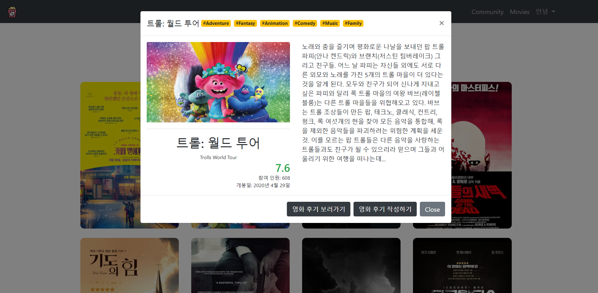

      - ### :sparkles: ManyToManyField에서 값 꺼내오기(@html)

        - 현재 모델의 구조는 하나의 영화에 다중의 장르값이 ManyToManyField에 저장되어 있는 상태다.

        - 따라서 각 영화의 장르들을 출력하기 위해서는, 필드의 값을 전부 가져와, 하나씩 출력해주어야 한다.

        - html에서는 `movie.genres.all`의 형태로 전체 값을 가져올 수 있다.

        - Django에서도 같은 방법(`movie.genres.all()`)을 통해 ManyToManyField의 값을 가져올 수 있다.

        - 소스코드
        
          - ```html
            <!-- movies/index.html -->
             
            <!-- 필드의 값을 전부 가져와 하나씩 꺼내야 하므로 모델.필드명.all로 불러온다 -->
            <a type="button" class="btn btn-warning btn-sm mx-1"
               href="">{{ genre }}</a>
            
      
            ```
        
            

- 추천 알고리즘

  - 평점을 등록한 유저는 해당 정보를 기반으로 영화를 추천 받을 수 있어야 합니다.

  - 추천 알고리즘의 지정된 형식은 없으나, 사용자는 반드시 최소 1개 이상의 방식으로 영화를 추천 받을 수 있어야 합니다.

  - 추천 방식은 팀 별로 자유롭게 선택할 수 있으며 어떠한 방식으로 추천 시스템을 구성했는지 설명할 수 있어야 합니다.

    - 추천 알고리즘

      0. 이 기능은 로그인한 유저에게만 제공되는 기능이다.
      1. 현재 로그인 된 유저가 작성한 영화 리뷰가 없는 경우
         1. DB 기준으로 평점이 높은 영화를 20개 추천한다.
      2. 현재 로그인 된 유저가 작성한 영화 리뷰가 있는 경우
         1. 각각의 장르를 key값으로 갖는 dictionary를 생성한다.
         2. 유저가 작성한 영화 리뷰를 모두 가져온다.
         3. 유저가 작성한 영화 리뷰의 점수를 영화가 속한 장르에 더한다.
            - 유저가  ‘작은 아씨들’ 영화에 8점의 리뷰를 남겼다면, ‘작은 아씨들’이 속한 ‘Drama’와 ‘Romance’ 장르에 각각 8점을 추가합니다.
         4. 가장 점수가 높은 장르의 영화를 DB 기준으로 평점이 높은 순으로 최대 20개를 추천한다.
            - 해장 장르의 영화가 20개 미만인 경우 20개 미만의 영화를 추천할 수 있다.
            - 두 개 이상의 장르가 같은 점수를 받았을 경우, 장르 pk가 작은 영화를 추천힌다.

      - 소스코드

        - ```python
          @login_required
          def recommend(request): 
            gdict = {12: 0, 14: 0, 16: 0, 18: 0, 27: 0, 28: 0, 35: 0, 36: 0, 37: 0, 53: 0, 80: 0, 
                    99: 0, 878: 0, 9648: 0, 10402: 0, 10749: 0, 10751: 0, 10752: 0, 10770: 0}
          
            # 유저가 작성한 아티클을 기반으로, 각 아티클에 매긴 점수를 영화가 속한 장르에 각각 더해준다.
            articles = Article.objects.filter(user=request.user)
            for article in articles:
              movie = get_object_or_404(Movie, pk=article.movie_title.pk)
              for genre in movie.genres.all():
                gdict[genre.pk] += article.rank
            
            # 현재 dict에서 가장 큰 값을 가진 장르를 가져온다.
            maxi = max(gdict.items(), key=operator.itemgetter(1))[0]
          
            # 만약 가져온 maxi값이 0이라면(작성한 리뷰가 없거나, 모든 리뷰의 평점이 0점인 경우)
            if gdict[maxi] == 0:
              movies = Movie.objects.order_by('-popularity')[:20]
            else:
              genre = get_object_or_404(Genre, pk=maxi)
              movies = genre.movie_set.order_by('-popularity', '-release_date')[:20]
          
            paginator = Paginator(movies, 20)
            page_number = request.GET.get('page')
            page_obj = paginator.get_page(page_number)
          
            context = {
              'movies': movies,
              'page_obj': page_obj,
            }
            return render(request, 'movies/index.html', context)
          ```
      
        - ### :sparkles: ManyToManyField 에서 값 꺼내쓰기(@Django)
      
          - 현재 모델의 구조는 하나의 영화에 다중의 장르값이 ManyToManyField에 저장되어 있는 상태다.
          - 따라서 필드의 값을 전부 가져와, 하나씩 사용해야 한다.
            - html에서는 `movie.genres.all()`의 형태로 전체 값을 가져올 수 있다.
            - html에서도 같은 방법(`movie.genres.all`)을 통해 ManyToManyField의 값을 가져올 수 있다.
        
    
  - **[평점이 없는 경우]**
    
    - 작성한 리뷰가 없는 '회원'의 경우
      
      - 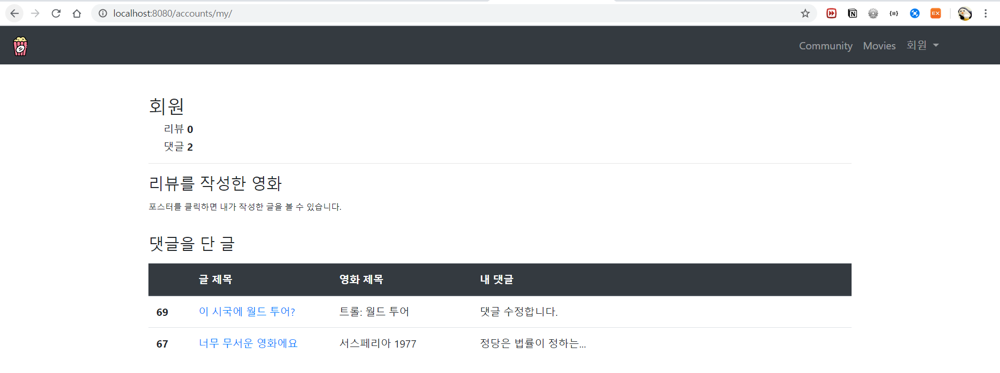
    - DB 기준 평점이 높은 영화 20개를 추천한다.
    
    - 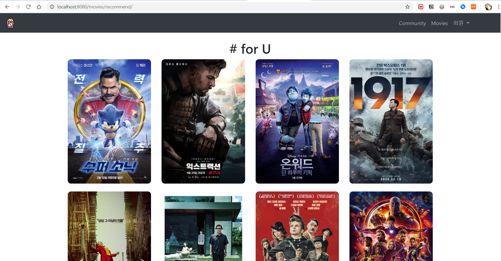
    
    - **[평점이 있는 경우]**

      - 작성한 리뷰가 있는 '회원1'의 경우

      - 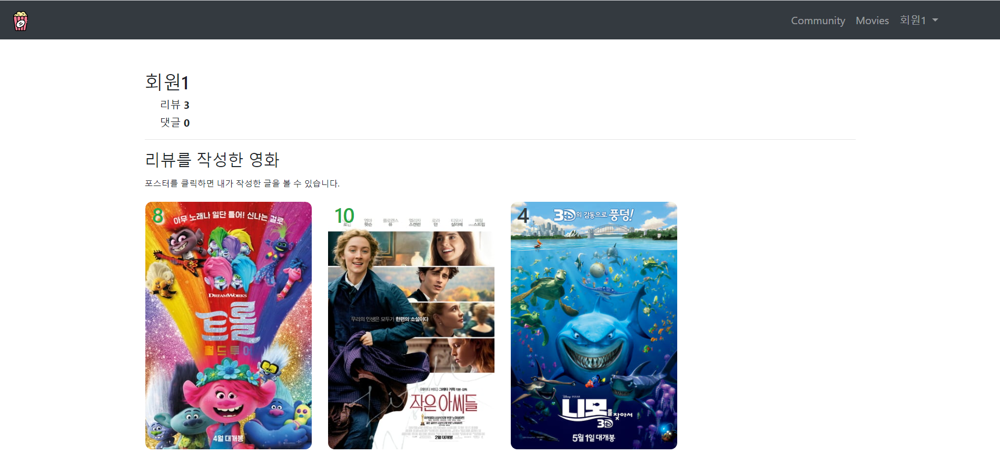

      - 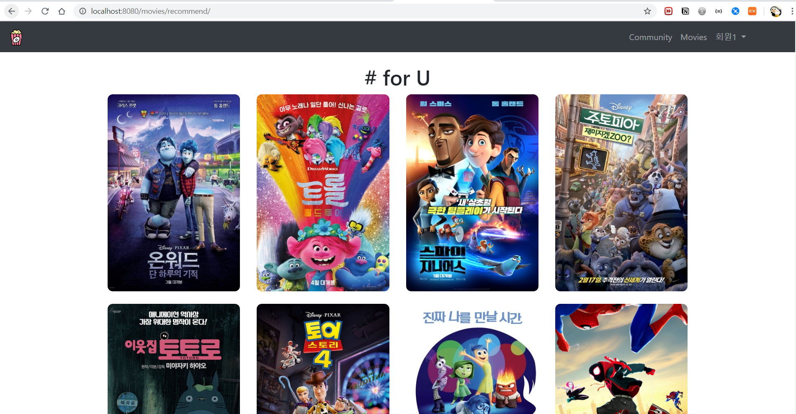
    
      - 작성한 리뷰가 있는 '안녕'의 경우
    
      - 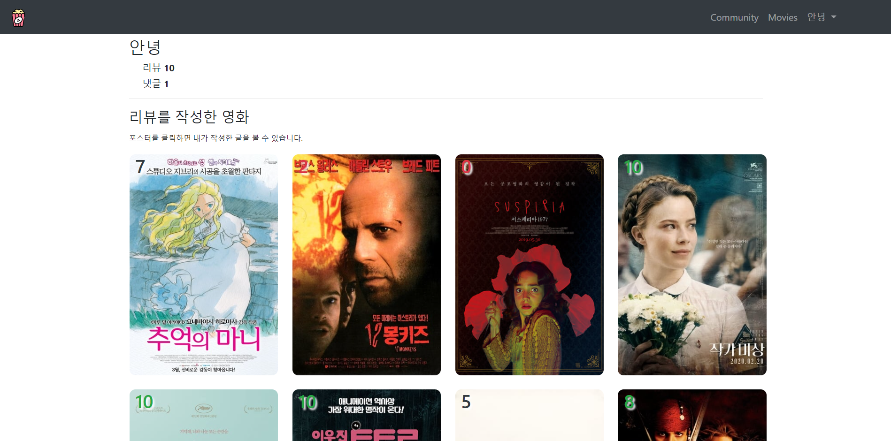
    
      - 
    
        

- 커뮤니티
  
  - 영화 정보와 관련된 대화를 할 수 있는 커뮤니티 기능을 구현해야 합니다.
  
  - 로그인한 사용자만 글을 조회 / 생성 할 수 있으며 작성자 본인만 글을 수정 / 삭제 할 수 있습니다. 
  
  - 사용자는 작성된 게시글에 댓글을 작성할 수 있어야 하며 작성자 본인만 댓글을 삭제 할 수 있습니다. 
  
  - 각 게시글 및 댓글은 생성 및 수정 시각 정보가 포함되어야 합니다.
  
    - **[리뷰 작성/조회/수정/삭제]**
  
    - 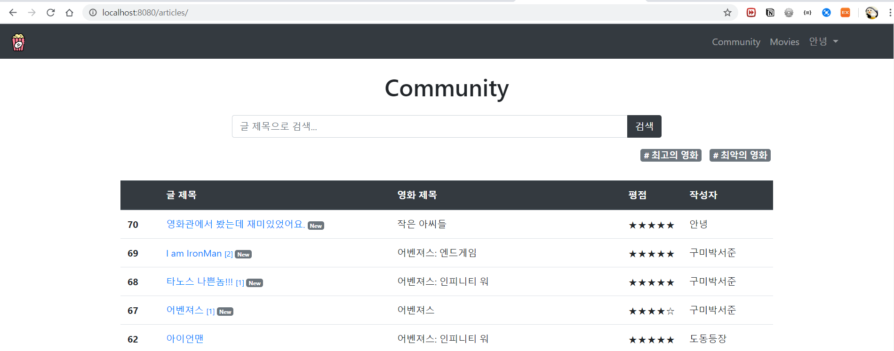
  
    - 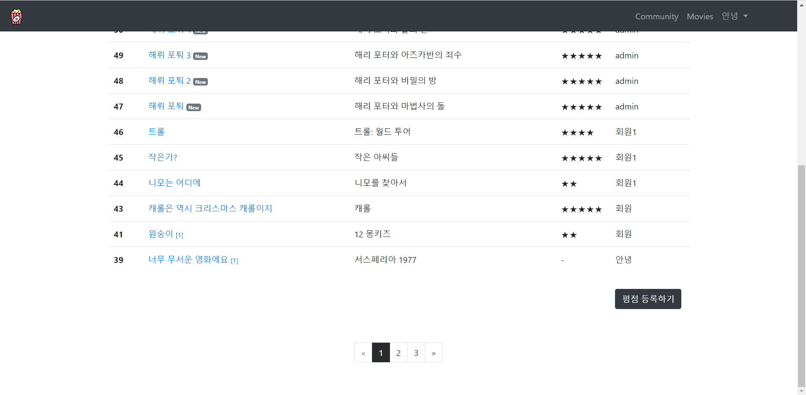
  
      - 모든 유저는 Community 하단의 `평점 등록하기`버튼을 통해 평점을 등록할 수 있다.
      
      - 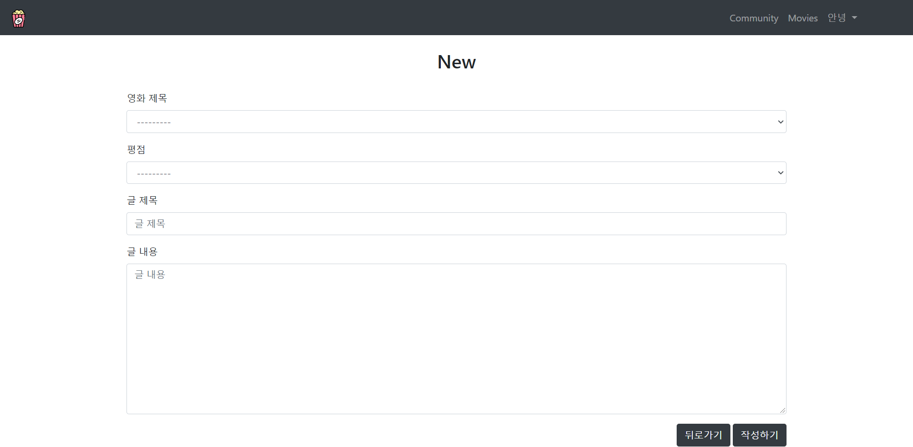
      
      - 또한 글 상세보기 메뉴에서 자신의 글에만 나타나는 수정/삭제 버튼을 통해 자신이 작성한 글을 수정/삭제할 수 있다.
      
      - 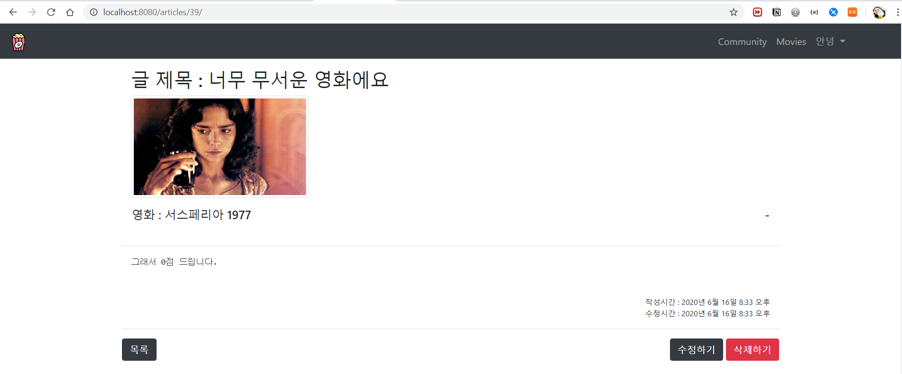
      
      - 수정하기를 선택할 경우, 기존에 작성했던 글이 자동으로 입력된다.
      
      - 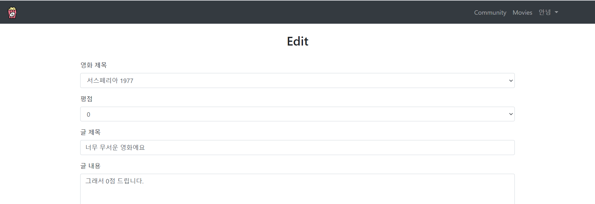
        
      - 삭제하기를 선택할 경우, 삭제 여부를 한번 더 확인하는 모달창이 나타난다.
      
      - 
      
      - ### :sparkles: CSS: pre tag의 줄바꿈(리뷰 상세보기)
      
        - ```html
          <pre style="white-space:pre-wrap"></pre>
          ```
      
        - pre tag 내 style 속성으로 `white-space:pre-wrap`을 주게 되면 스크롤바 없이 줄바꿈이 일어나게 된다. 부트스트랩의 `class="text-break"`는 p tag에서만 사용이 가능하다.
      
      
      
      - **[댓글 작성/조회/수정/삭제]**
      
      - 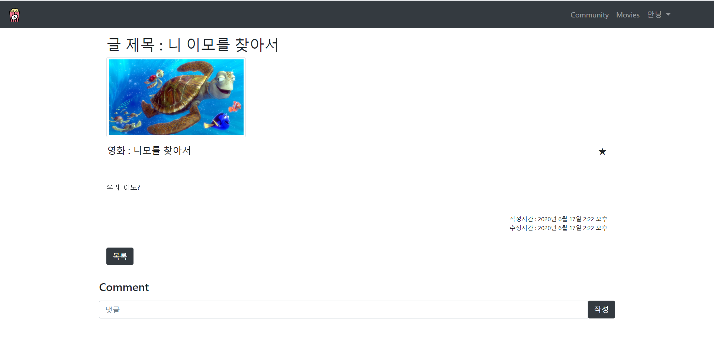
      
      - 글 상세보기 페이지 하단의 댓글 작성란에 댓글을 작성한 뒤, 작성 버튼을 클릭하거나 엔터 키를 누르게 되면 댓글이 입력된다.
      
      - 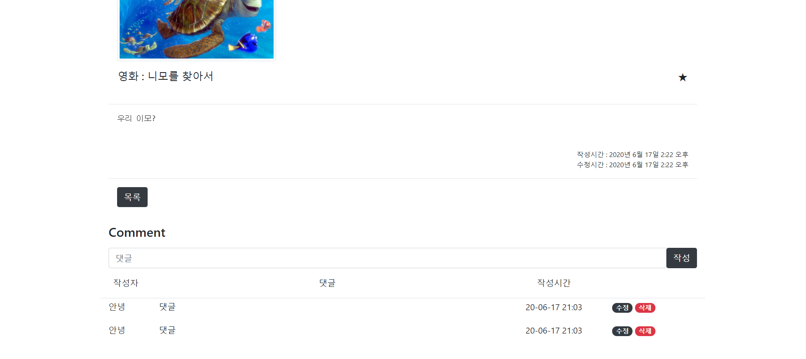
      
      - 하나 이상의 댓글이 생기면 테이블 형태의 댓글창이 생긴다. 내 댓글이 아닌 경우에는 수정/삭제 버튼이 뜨지 않는다.
      
      - 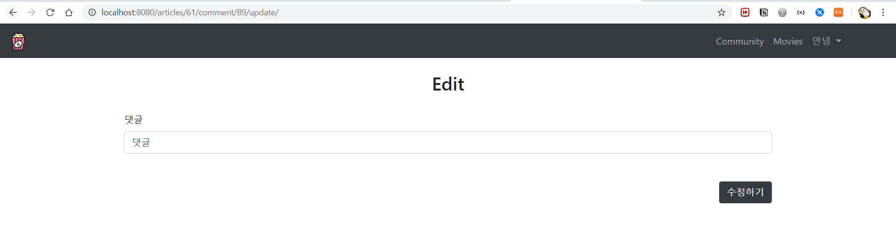
      
      - 댓글 수정 버튼을 누르면 댓글을 수정할 수 있다. 수정 전의 댓글이 자동으로 등록된다.
      
      - 댓글 삭제 버튼을 누르면 댓글을 삭제할 수 있다. 리뷰와는 달리 삭제하겠냐고 묻는 모달창 없이 바로 삭제된다.


## 8. 추가 기능

- 유저 관리(accounts)

  ### [유저 페이지]

  - 유저는 자신이 작성한 글과 댓글을 모아볼 수 있습니다.

  - 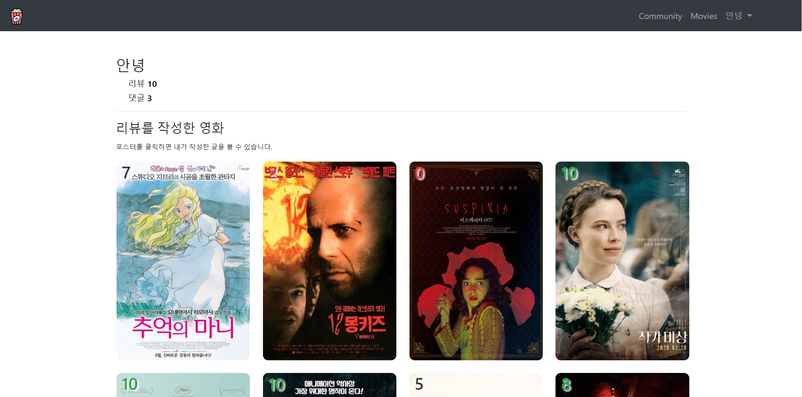

  - 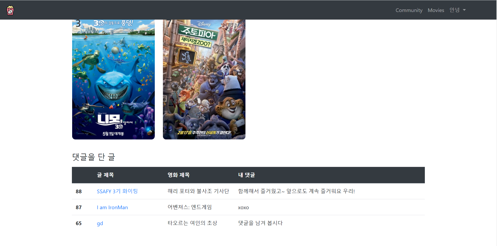

  - 리뷰가 있을 경우, 해당 영화 포스터가 나타나며 왼쪽 상단에 리뷰의 평점이 보인다.

    - 평점이 7점 초과인 경우 녹색, 3점 미만인 경우 빨간색, 그 외의 경우는 검은 색으로 보인다.

  - 영화 포스터를 클릭할 경우 내가 작성한 글을 볼 수 있으며, 댓글을 단 글의 글 제목을 클릭할 경우 내가 댓글을 단 글을 볼 수 있다.

  - 소스 코드

    - ```python
      # accounts/views.py
      
      @login_required
      def myinfo(request):    # 내 정보(내가 작성한 글, 내가 작성한 댓글)를 볼 수 있는 페이지
        user = request.user
        articles = Article.objects.filter(user=user).order_by('-pk')  
          # 전체 Article에서 작성자가 현재 요청한 유저인 글을 pk 역순으로 받아온다.
        comments = Comment.objects.filter(user=user).order_by('-pk')  
          # 전체 Comment에서 작성자가 현재 요청한 유저인 댓글을 pk 역순으로 받아온다.
      
        context = {
          'user': user,
          'articles': articles,
          'comments': comments,
        }
        return render(request, 'accounts/user.html', context)
      ```

    - ```html
      <!-- accounts/user.html -->
      
      
      
      <div class="container my-5">
        <h3>{{ user.username }}</h3>
        <div class="container mx-2">
          <h6>리뷰 <span class="font-weight-bold">{{ articles|length }}</span></h6>
          <h6>댓글 <span class="font-weight-bold">{{ comments|length }}</span></h6>
        </div>
        <hr>
        <div class="my-3">
        <h4>리뷰를 작성한 영화</h4>
          <small>포스터를 클릭하면 내가 작성한 글을 볼 수 있습니다.</small>
        </div>
        <div class="row">
          
          <div class="col-3 mb-4 mx-0">
            <a href="">
              <div class="card">
                <div class="image">
                     
                  <!-- 내가 작성한 영화의 평점이 7점 초과인 경우 녹색, 3점 미만인 경우 빨간색, 
      			둘 다 아닌 경우 까만색으로 영화 포스터의 좌상단에 보인다. -->
                  
                  <h2 class="text-success">{{ article.rank }}</h2>
                  
                  <h2 class="text-danger">{{ article.rank }}</h2>
                  
                  <h2 class="text-dark">{{ article.rank }}</h2>
                  
                </div>
              </div>
            </a>
          </div>
          
        </div>
      
        <h4 class="my-3">댓글을 단 글</h4>
        <table class="table table-hover" style="width: 100%">
          <thead class="thead-dark">
            <tr>
              <th style="width: 6%"></th>
              <th style="width: 20%">글 제목</th>
              <th style="width: 20%">영화 제목</th>
              <th style="width: 54%">내 댓글</th>
            </tr>
          </thead>
          <tbody>
            
            <tr>
              <th scope="row">{{ comment.pk }}</th>
              <td> <a href="">{{ comment.article.title }}</a></td>
              <td> {{ comment.article.movie_title }}</td>
              <td> {{ comment.content }}</td>
            </tr>
            
          </tbody>
        </table>
      
      </div>
      
      ```

    - ### :sparkles: CSS: object-fit 속성​

      - `object-fit` 속성은 대체되는 요소의 내용(img, video, object, svg 등)이 지정된 너비와 높이에 맞게 장착되는 방식을 지정한다.
        - `fill`: 대체되는 요소의 내용이 지정된 높이에 따라 확대, 축소, 늘어나거나 움츠러든다. 요소를 가득 채울 수 있는 크기로 변화되면서 종횡비는 유지되지 않는다.
        - `contain`: 내용이 종횡비를 유지하면서 요소에 정의된 너비와 높이안에서 가능한한 많이 확대시킨다.
        - `cover`: 내용이 종횡비를 유지하면서 정의된 너비와 높이를 가득 채울때까지 확대된다.
        - `none`: 내용의 크기가 요소의 크기와 무관하게 기본 알고리즘에 의해 조정된다. 원본의 크기 가운데 정렬된 형태를 띈다.
        - `scale-down`: 내용의 크기를 아무것도 지정되지 않거나 contain이 지정되어 있는 것처럼 변경한다. 원본 크기보다 작아진다.
      - 영화 포스터 이미지가 동일한 크기로 보이기를 원했기 때문에 가장 많은 포스터의 크기에 맞춰, 그보다 작은 포스터들이 종횡비를 맞춘 채 확대 또는 축소되기를 바랐다. 따라서 `object-fit: cover;` 속성을 사용했다.

      

- 커뮤니티

  ### [새 글 버튼]

  - Community의 글 목록에서는 현재 시간을 기준으로, 작성한 지 6시간이 지나지 않은 글에는 제목 옆에 New 버튼이 뜹니다.

  - 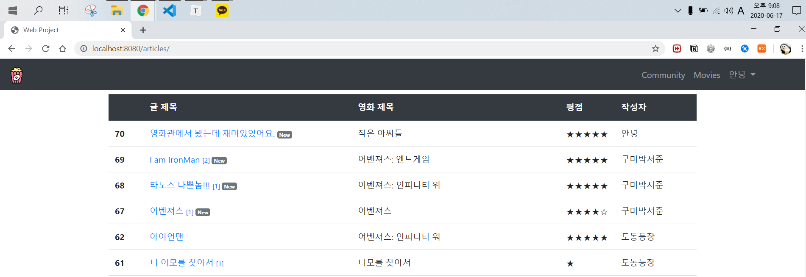

  - ### :sparkles: Django에서 현재 시간 받아오기

    - Django에서 현재 시간대를 받기 위해 `datetime.datetime`을 사용하였으나 원하는 결과값을 얻지 못했다. 실제로 순수 파이썬 프로그램에서는 문제없이 실행되는 것을 확인했기 때문에 더 당황스러웠다. 

    - ```python
      # community/views.
      import datetime
      
      
      def index(request):
        articles = Article.objects.order_by('-pk')
        check_now = datetime.datetime.now()
        check_delta = datetime.datetime.now() - timedelta(hours=6)
        # 현재 시간 기준으로 6시간 이내에 작성한 글에는 new를 띄우기 위한 timedelta값
        # 이 값을 index.html로 넘겨 html단에서 처리한다.
      
        paginator = Paginator(articles, 15) # 숫자만 변경하면 한 페이지에 들어갈 글 수를 변경할 수 있음
        page_number = request.GET.get('page')
        page_obj = paginator.get_page(page_number)
      
        context = {
          'articles': articles,
          'page_obj': page_obj,
          'check_delta' : check_delta,
          'check_now' : check_now,
        }
        return render(request, 'articles/index.html', context)
      ```

    - ```html
      <!-- community/index.html -->
      
      ```

    - 상단의 소스코드는 check_delta값을 views.py에서 생성한 뒤, 그 값을 index.html으로 넘겨 html단에서 비교를 하고 있다. 그때는 특별한 에러가 발생하지 않았으나(잘못된 명령이라 무시했던 것으로 보인다.) views.py에서 Article.object의 created_at 과 check_delta값을 비교했을 때, `can't compare offset-naive and offset-aware datetimes`에러가 발생했다.

    - 구글링을 통해 Django에서는 `datetime.now()`가 아니라 ` check_now = timezone.now() `를 사용해야 한다는 조언을 얻을 수 있었다.

    - ```python
      from datetime import timedelta
      from django.utils import timezone
      
      
      def index(request):
        articles = Article.objects.order_by('-pk')
        check_now = timezone.now()      
        check_delta = timezone.now() - timedelta(hours=6)
        # 현재 시간 기준으로 6시간 이내에 작성한 글에는 new를 띄우기 위한 timedelta값
        # 이 값을 index.html로 넘겨 html단에서 처리한다.
      
        paginator = Paginator(articles, 15) # 숫자만 변경하면 한 페이지에 들어갈 글 수를 변경할 수 있음
        page_number = request.GET.get('page')
        page_obj = paginator.get_page(page_number)
      
        context = {
          'articles': articles,
          'page_obj': page_obj,
          'check_delta' : check_delta,
          'check_now' : check_now,
        }
        return render(request, 'articles/index.html', context)
      ```

    - ```html
      <!-- community/index.html -->
      
      ```

      

  ### [글 검색]

  - 유저는 해당 키워드가 들어간 제목의 리뷰를 검색할 수 있습니다.
  - 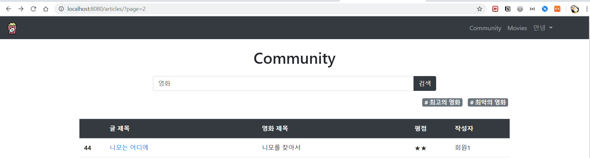

  - 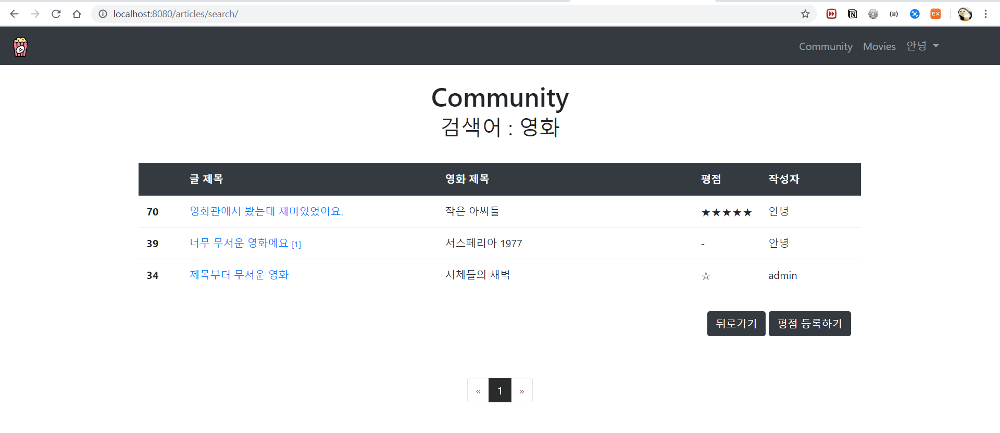
    - 검색창에 검색어를 입력한 뒤, 엔터를 치거나 검색 버튼을 누르면 해당 검색어에 대한 결과물을 받을 수 있다.

    - 소스코드

    - ```html
      <!-- community/index.html -->
      <!-- 검색 -->
      
      <div class="row">
        <div class="col-2"></div>
        <div class="my-3 input-group col-8 text-center">
          <input type="text" class="form-control mx-auto my-0" id="search" placeholder="글 제목으로 검색..." style="width: 80%">
          <div class="input-group-append">
            <button type="button" class="btn btn-dark" id="search_btn">검색</button>
          </div>
        </div>
        <div class="col-2"></div>
      </div>
      
      <script>
        // 검색 input tag에서 enter key의 입력이 감지된 경우, input tag의 입력값을 쿠키에 넣어 search/ 로 전송한다.
        const Search = document.getElementById('search');
        Search.addEventListener('keypress', function (event) {
          if (event.key === 'Enter') {
            kwd = document.getElementById('search').value;
            console.log(kwd)
            if (kwd != '') {
              var date = new Date();
              date.setTime(date.getTime() + 1 * 60 * 60 * 1 * 1000) // 1시간 쿠키 저장
              document.cookie = 'kwd' + '=' + kwd + ';expires=' + date.toUTCString() + ';path=/';
              window.location.href = "search/";
            }
          }
        })
        // 검색 버튼에서 클릭이 감지된 경우, input tag의 입력값을 쿠키에 넣어 search/ 로 전송한다.
        const Searchbtn = document.getElementById('search_btn');
        Searchbtn.addEventListener('click', function (event) {
          kwd = document.getElementById('search').value;
          console.log(kwd)
          if (kwd != '') {
            var date = new Date();
            date.setTime(date.getTime() + 1 * 60 * 60 * 1 * 1000) // 1시간 쿠키 저장
            document.cookie = 'kwd' + '=' + kwd + ';expires=' + date.toUTCString() + ';path=/';
            window.location.href = "search/";
          }    
        })
      </script>
      
      ```

    - ```python
      # community/views.py
      
      @login_required
      def search(request):
        kwd = request.COOKIES['kwd']  
        # articles/index.html에서 저장한 키워드를 쿠키에서 꺼낸다.
        articles = Article.objects.filter(title__contains=kwd).order_by('-pk')
        # 키워드를 제목에 포함하는 글 검색해 pk 역순으로 정렬
        
        paginator = Paginator(articles, 15)
        page_number = request.GET.get('page')
        page_obj = paginator.get_page(page_number)
        
        context = {
          'kwd': kwd,
          'articles': articles,
          'page_obj': page_obj,
        }
        return render(request, 'articles/index.html', context)
      ```

    - ### :sparkles: 쿠키

      - script와 django는 기본적으로 서로 통신할 수 없다. 둘 사이에 데이터를 주고받기 위해서는 axios를 사용하는 등의 방법이 있지만 이번 프로젝트에서는 쿠키를 활용해 보았다.
      - `검색` 버튼이 클릭되었을 때 작동하는 이벤트 리스너와, `입력창`에 엔터키 입력이 들어왔을 때 작동되는 이벤트 리스너를 달아주었고,  해당 이벤트가 발생했을 때 쿠키에 입력창에 있는 데이터를 저장한다.
        - `document.cookie = 'kwd' + '=' + kwd + ';expires=' + date.toUTCString() + ';path=/';`
      - views.py에서는 `kwd = request.COOKIES['kwd'] `의 방식으로 쿠키의 값을 가져올 수 있다.
      - Movies의 `영화 제목으로 검색`기능에서도 같은 방법을 사용했다.

      

  ### [최고의 영화 / 최악의 영화]

  - 커뮤니티 상단의 `#최고의 영화`, `#최악의 영화` 버튼

  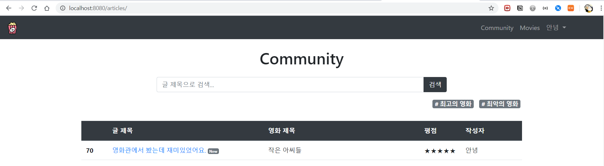

  - 최고의 영화

    - 유저는 평점이 10점인 리뷰를 모아 볼 수 있습니다.
    - 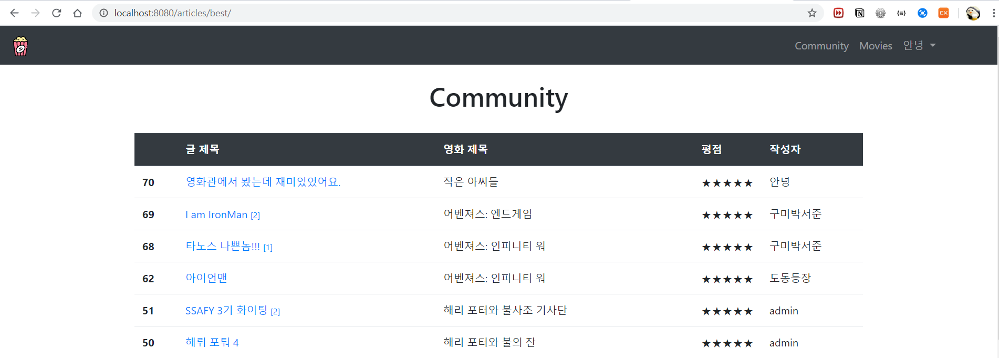

  - 최악의 영화

    - 유저는 평점이 0점인 리뷰를 모아 볼 수 있습니다.
    - 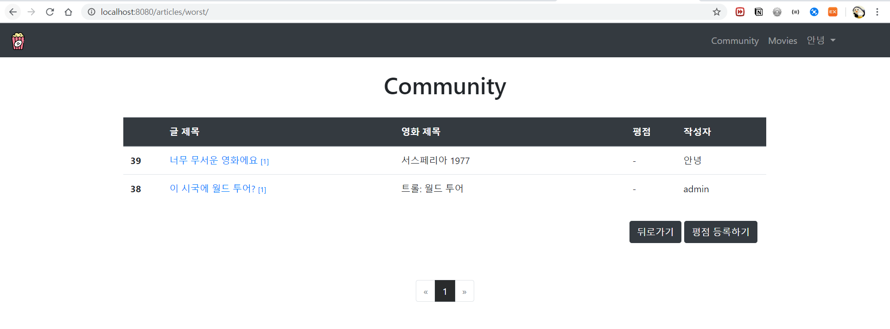

  - 소스 코드

    ```python
    # community/views.py
    
    @login_required
    def best(request):
      articles = Article.objects.filter(rank=10).order_by('-pk')
    
      paginator = Paginator(articles, 15)
      page_number = request.GET.get('page')
      page_obj = paginator.get_page(page_number)
      
      context = {
        'articles': articles,
        'page_obj': page_obj,
      }
      return render(request, 'articles/index.html', context)
    ```

  - 최악의 영화는 현재 코드 세 번째 줄을 `articles = Article.objects.filter(rank=0).order_by('-pk')`로 수정하면 된다.

  

- 영화 정보(movies)

  ### [장르별 조회]

  - 유저는 영화를 장르별로 모아볼 수 있습니다.

  - 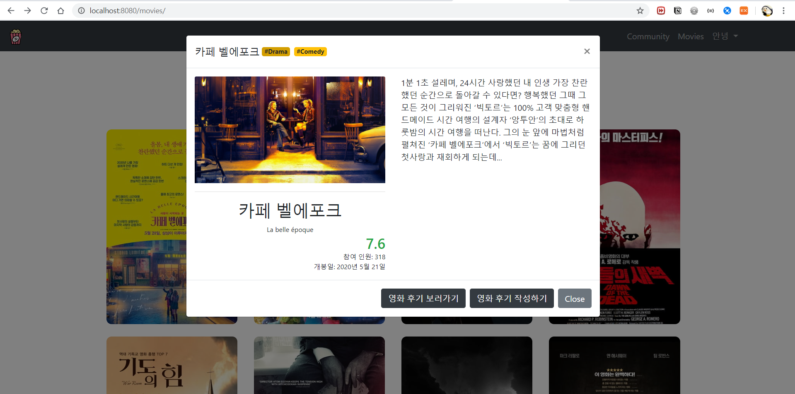

    - 영화 상세보기 모달창에서 가장 상단의 영화 제목 옆의 장르 버튼(노란색, 현재 왼쪽 버튼은 활성화된 상태)를 클릭하면, 해당 장르의 영화를 모아볼 수 있습니다.

  - 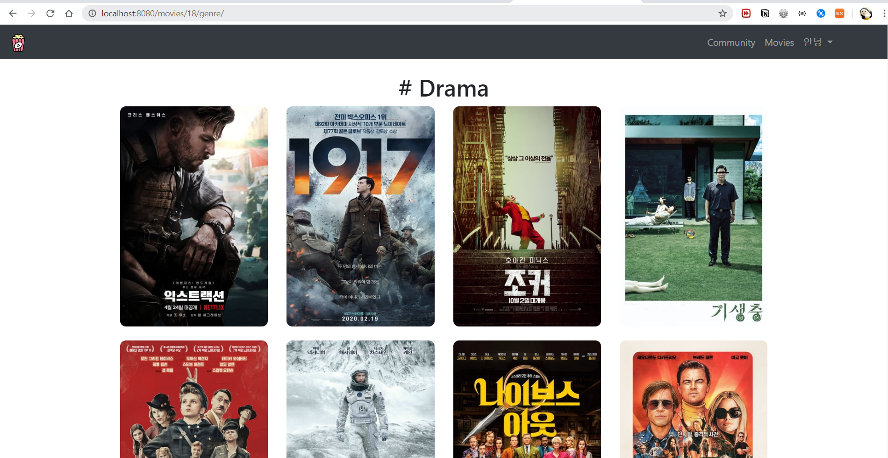

  - 소스코드

    - ```python
      # movies/views.py
      
      def movie_genre(request, genre_pk):
        genre = get_object_or_404(Genre, pk=genre_pk)
        # 영화를 장르별로, 인기가 많고 최신에 나온 것 순으로 출력한다.
        movies = genre.movie_set.order_by('-popularity', '-release_date')
      
        paginator = Paginator(movies, 20)
        page_number = request.GET.get('page')
        page_obj = paginator.get_page(page_number)
      
        context = {
          'genre': genre,
          'movies': movies,
          'page_obj': page_obj,
        }
        return render(request, 'movies/index.html', context)
      ```

      
    
  
### [영화별 후기 작성/조회/수정/삭제]

- 유저는 한 영화에 대한 후기를 모아볼 수 있으며, 그 게시판 내에서의 후기 작성/조회/수정/삭제가 가능합니다. (전체 후기 조회/작성/수정/삭제와 같은 기능이 영화별로 분리된 공간에서 제공됨) 

  - **후기 모아 보기(조회)**

  - 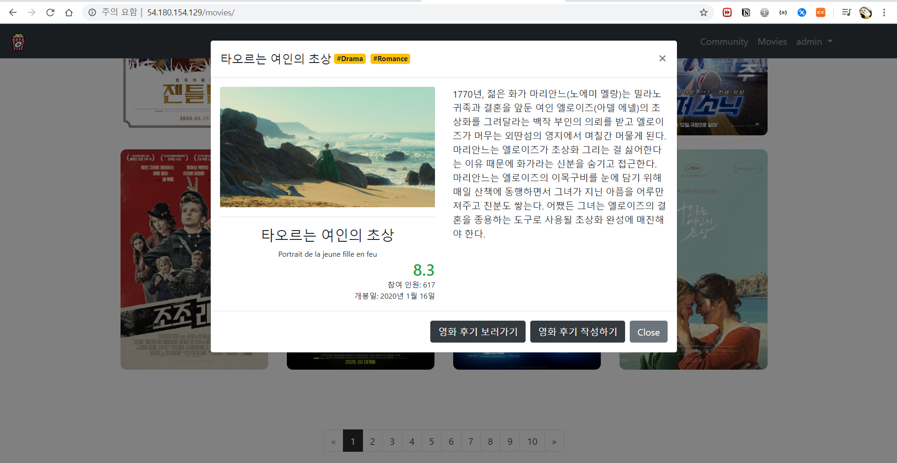

    - 로그인한 상태로 전체 영화보기(Movies)에서 영화 포스터를 클릭하게 되면, 영화 상세정보 모달창 하단에 `영화 후기 보러가기` 버튼과 `영화 후기 작성하기` 버튼이 보인다. 이 때 `영화 후기 보러가기`버튼을 클릭하면 해당 영화의 모든 후기를 볼 수 있다.

  - 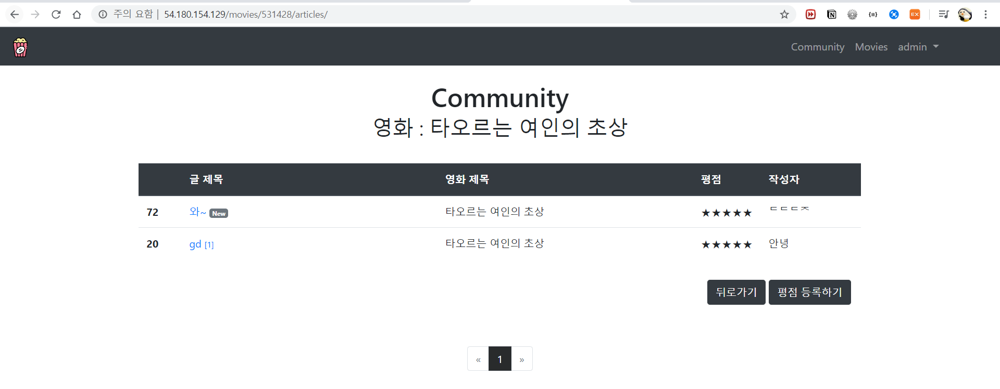

  - **후기 작성하기**

  - 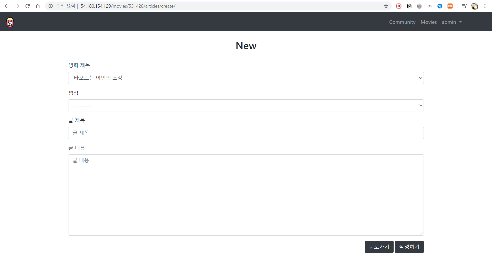

    - `영화 후기 보러가기`를 통해 접속한 Community에서(이하 영화별 Community) 평점 등록하기를 선택하면 해당 영화의 제목이 미리 선택되어 있는 것을 확인할 수 있다. 전체 영화보기(Movies)에서 영화 포스터를 클릭했을 때 나타나는 `영화 후기 작성하기`버튼을 클릭했을 때에도 글쓰기 양식의 영화 제목이 해당 영화로 선택된 것을 확인할 수 있다.

    - ### :sparkles: 원하는 값을 모델폼 생성 시 넘겨주기

      - ```python
        # movies/views.py
        
        def movie_articles_create(request, movie_pk):
          movie = get_object_or_404(Movie, pk=movie_pk)
          if request.method == 'POST':
            form = ArticleForm(request.POST)
            if form.is_valid():
              article = form.save(commit=False)
              article.user = request.user
              article.save()
              return redirect('movies:movie_articles', movie_pk)
          else:
            form = ArticleForm(initial={'movie_title':movie})	
            # 폼 생성시 initial값 지정
          context = {
            'form': form,
          }
          return render(request, 'articles/form.html', context)
        ```

        - 해당 폼 생성 시, `initial={'필드값': 넣고자 하는 값}`을 넣는다.

  - **후기 상세보기**

  - 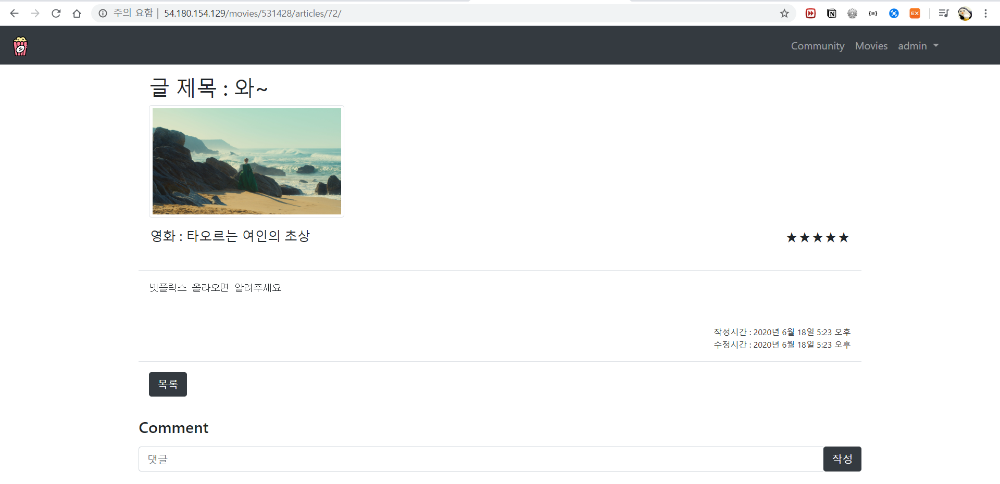

    - 후기 상세보기에서 목록 버튼을 클릭하게 되면, 영화별 Community로 돌아간다. 

  - **후기 수정하기**

    - 후기 수정하기의 로직은 Community에서의 로직과 같으나, 후기 수정 후 영화별 Community 내의 영화 상세보기 페이지로 접속된다.

  - **후기 삭제하기**

    - 후기 삭제하기의 로직은 Community에서의 로직과 같으나, 후기 삭제 후 영화별 Community로 접속된다.

  - ### :sparkles: render와 redirect

    - 해당 기능은 전체 Community와 동일한 기능을 하고 있으나, 현재 선택된 영화가 무엇인지에 대한 정보를 계속해서 전달해야 할 필요가 있다. 그래서 해당 영화의 pk를 url에 담아 전달했다.

    #### [render]

    ```html
    render(request, template_name, context=None, content_type=None, status=None, using=None)
    ```

    - render의 파라미터, 이 중 `request`와 `template_name`은 필수요소
    - `context`를 통해 원하는 인자, views.py에서 사용하던 파이썬 변수,를 html 템플릿으로 넘길 수 있다. 딕셔너리형
    - 템플릿을 불러온다.

    #### [redirect]

    ```html
    redirect(to, permanent=False, *args, **kwargs)
    ```

    - redirect의 파라미터, `to`는 이동할 URL, 단지 URL로 이동만 하기 때문에 render처럼 context값을 전달할 수 없다.

    - URL로 이동한다.

    - redirect에서 URL이 필요로 하는 값을 전달하기 위해서는 인자를 넘겨주어야 한다.

      - ```python
        context = {
            'movie_pk': movie_pk,
            'article_pk': article_pk,
        }
        return redirect('movies:movie_articles_detail', context)
        ```

      - 위와 같이 작성한 코드는 오류가 발생한다. redirect는 context를 전달할 수 없기 때문이다. 

      - 해당 인자(movie_pk, article_pk)를 URL로 전달하고 싶다면 다음과 같이 코드를 수정해야 한다.

        - ```Python
          return redirect('movies:movie_articles_detail', movie_pk, article_pk)
          ```

  
### [영화 검색]

  - 유저는 해당 키워드가 들어간 제목의 영화를 검색할 수 있습니다.
- 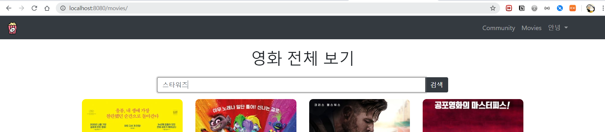
  
  - 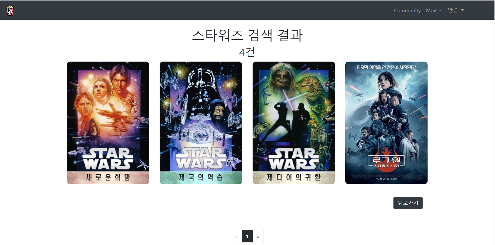
    - 해당 소스 코드는 [Community > 검색]과 유사하므로 생략하였다. (`def search(request)` 로 검색)


## 9. 배포 서버 URL 

- http://54.180.154.129/


## 10. 기타(느낀점)

- 동규
  - 하루의 시간을 가지고 진행한 관통프로젝트와는 다르게 약 1주일의 긴 시간을 두고 진행한 첫 프로젝트였다. 처음엔 막막했지만 한 학기동안 배운 내용을 모두 갈아넣는다고 생각을 하며 차근차근 진행했다. liveshare를 이용하여 협업을 하다보니 팀원이 어느부분을 작성하고있는지 쉽게 알 수 있었고, 막히는 부분이 있거나 혼자서 고민을 할 때 바로 피드백을 받을 수 있어 시간을 절약할 수 있었다. 수업을 듣는 시간이 없으니 하루종일 프로젝트에만 전념하면 빨리 끝낼 수 있을거라 생각했지만, 시간은 정말 빠르게 흘러갔고 매일 아침과 오후 팀 회의를 하는 시간에 오늘 한 내용을 되돌아보지 않았다면 시간분배를 제대로 하지 못했을것이다. 특히 최대한 화요일까지 기능구현을 하고 수요일 하루를 UCC제작 시간으로 빼두었는데 이 판단이 아니었다면 UCC 제출 기한을 지키지 못했을 것이라 생각한다.
  - 이번 프로젝트를 진행하며 처음 사용해본 것들이 있는데 Trello와 git branch기능이다. 아침저녁 회의를 하며 회의록을 작성하지는 않았지만 Trello에 바로바로 입력하고 해야 할 일을 작성하고 일의 처리 여부에 따라 진행/완성으로 옮겨가며 작업을 하니 회의때 나온 내용들을 빠짐없이 완성할 수 있었다. 
  - git branch도 처음 사용해보는 기능이었다. git은 사용하면 사용할수록 어렵게 느껴지기만 한다. 지금까지는 push와 pull기능만 사용했다면 branch를 만들어 일과 외 시간에 혼자 작업한 내용을 올리고 master branch에 merge하였다. 머릿속으로 이해는 되지만 제대로 작동을 하는지, 이게 맞는지 의구심만 늘어갔고 결국 수박 겉 핥기 식으로만 사용했다고 생각한다. 원본을 master branch에 올려두고, 추가기능을 구현할 때 새 branch를 만들어 작성하고 master branch에 merge 하는 방식에 익숙해지려면 git과 더 친해져야겠다.
  - 이번 프로젝트는 아쉬운 부분이 조금 있지만 시간관리에도 성공하였고, 협업에 필요한 새로운 기능들도 접했으며 기능구현까지 마무리 한 성공적인 프로젝트로 기억에 남을 것이다.
- 도희
  - 코로나로 인해 온라인으로 수업을 진행하면서 단점만큼 장점도 있었지만, 프로젝트를 앞두고는 걱정이 많았다. 온라인으로 어떻게 협업할 것인가. 오프라인에서 함께 하는 작업들도 좋은 성과만을 가져오는 것은 아니지만, 그것보다 낫기는 힘들 것이라고 생각했기에 걱정이 앞섰다. 걱정이 오해였음을 밝히는데는 오랜 시간이 걸리지 않았다. 매일 아침 9시 30분이면 Google Meet과 VS Code Live Share 링크를 보내주신 동규님 덕분에 부지런히 프로젝트를 진행할 수 있었다. 또한 Trello를 통해 매일 함께 한 일을 정리함으로써 작은 문제 하나 없이 프로젝트를 완수할 수 있었다.
  - 배포를 하고 친구들에게 링크를 보냈던 그 순간! 혼자만 볼 때는 마냥 뿌듯했던 프로젝트였지만, 다른 친구들에게 링크를 보낸 뒤에는 아쉬움이 많이 남았다. 특히 카카오톡으로 링크를 보내서인지 대부분이 휴대폰으로 접속하면 이상하게 보인다는 반응이어서 더 그랬다. 미적 감각은 어쩔 수 없지만, 화면 크기에 맞게 반응하는 웹 페이지는 조금만 더 신경썼었더라면 되었을텐데, 하다못해 데스크탑이나 노트북과 같은 큰 화면과, 휴대폰과 같은 작은 화면의 두 가지 버전으로만 만들었어도 좋았을텐데 하는 아쉬움이 남았다.
  - 자유도가 높은 프로젝트를 진행하면서 '개발자로서의 나'보다 '사용자로서의 나'로 프로젝트를 바라보고자 노력했다. 내가 이 사이트를 이용한다면 어떤 기능이 필요할까, 지금 이 사이트의 어떤 부분이 불편한가에서 바라본 프로젝트는 어떤 기능을 더 추가해야 할까에 대한 해답을 제시해주었다. 프로그램을 만들다 보면 개발자로서 '어떻게' 구현할 것인가에 매몰되는 경우가 있는데, '무엇을' 구현할 것인가를 고민하는 과정은 하나의 기능을 넘어 전체적인 프로그램에 대해 생각할 수 있게 해 주었다. 다른 프로젝트를 할 때에도 사용자의 시선을 잃지 않아야겠다.
